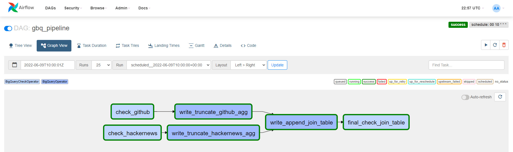
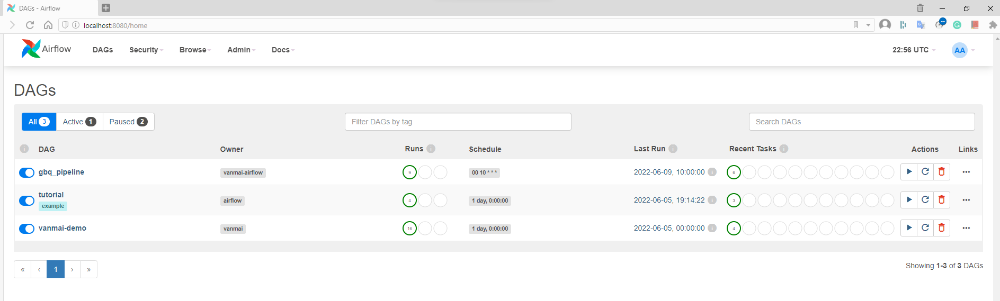
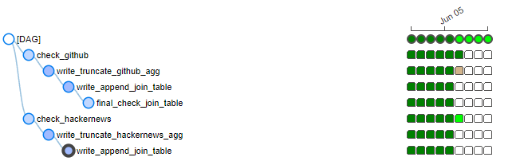
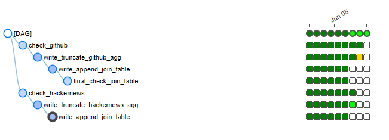
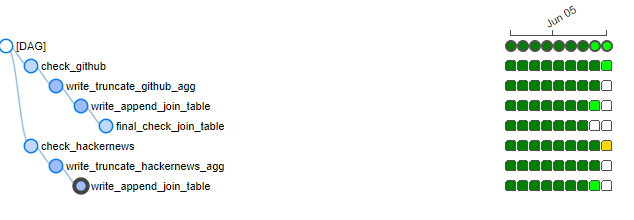
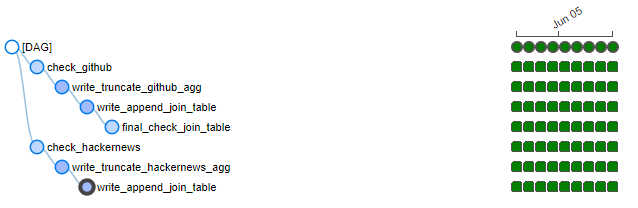
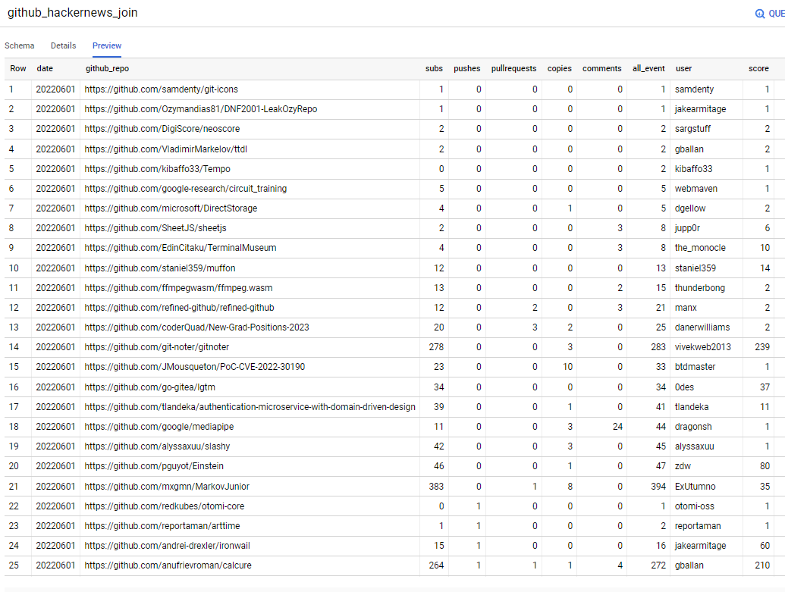

# GBQ PIPELINE WITH AIRFLOW AND DOCKER

## INTRO
In this project, Airflow will be use to build a pipeline that leverage public dataset of Bigquery, update aggregated table on a daily basis that feed into a dashboard on Data Studio 
<p align="center">
  
</p>

## SETUP 

### Prerequisite
- Docker desktop
- BigQuery account (sandbox)

### BigQuery
 - This project leverage 2 public dataset of bigquery: <strong>`bigquery-public-data.hacker_news`</strong> and <strong>`githubarchive.day`</strong>
 - For billing, we can use sandbox account with 10GB storage, and 1TB query data free of charge monthly
### Docker Images
 - Docker compose file: `./docker-compose.yml`
 - Airflow: <strong>`apache/airflow:2.0.1`</strong> (with Flower off, default examples off)
 - Redis: <strong>`redis:latest`</strong>
 - Postgre: <strong>`postgres:13`</strong>
 - 
## DAG SETUP
 - Dag file: `./dags/gbq_pipeline.py`
 <p align="center">
  
</p>

## RUNNING
```
> docker-compose up airflow-init -d
> docker-compose up -d
```
- Server at: <http://localhost:8080> (login & password: airflow)

<p align="center">

</p>

<p align="center">
  
   
</p>

<p align="center">
  
   
</p>

- Tables are created in GBQ project, and the final join table `github_hackernews_join` also get data populated
<p align="center">

</p>
<p align="center">

</p>
## DASHBOARD
